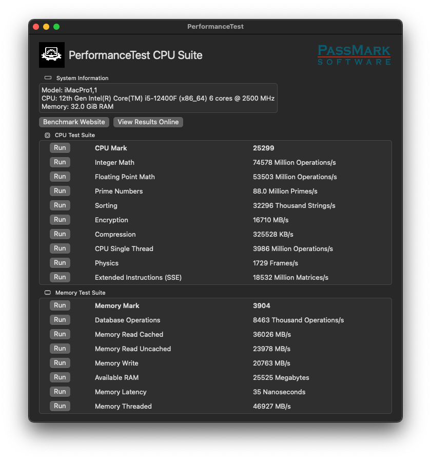

# ASRock-B660M-PG-Riptide-AlderLake

### Known Issue: Sleep Mode and BCLK Setting
If **BCLK (Base Clock)** is enabled in the BIOS settings of your motherboard, sleep mode will not function correctly.  
To enable proper sleep functionality, ensure that **BCLK is disabled** in the BIOS.



## Geekbench
**Geekbench measures your computer's processor and memory performance**: [Geekbench Browser](https://browser.geekbench.com/user/465996)

```md
| Name      | Platform | Architecture | Single-core Score | Multi-core Score |
|-----------|----------|--------------|-------------------|------------------|
| iMacPro1,1| macOS    | x64          | 2510              | 11424            |
```

```md
| Model                         | API                     | Platform       | Score   |
|-------------------------------|-------------------------|----------------|---------|
| AMD Radeon RX 6600 XT Compute | OpenCL                  | macOS 64-bit   | 72091   |
| AMD Radeon RX 6600 XT         | Metal                   | macOS 64-bit   | 122555  |
```

## User's Hardware Specification

```md
| Component              | Model / Specification                                     | Compatibility |
|------------------------|-----------------------------------------------------------|---------------|
| **Motherboard**        | ASROCK B660M PG Riptide (BIOS Version: 11.05)             | ✅ OK         |
| **Processor**          | Intel Core i5-12400F                                      | ✅ OK         |
| **CPU Cooler**         | DEEPCOOL AK400 ZERO DARK PLUS                             | ✅ OK         |
| **RAM**                | Patriot Viper Steel 32Gb DDR4 4133MHz (PVS416G413C9K)     | ✅ OK         |
|                        | (4x8Gb KIT)                                               |               |
| **GPU**                | Sapphire AMD Radeon RX 6600 XT                            | ✅ OK         |
| **Audio**              | 7.1 CH HD Audio (Realtek ALC897 Audio Codec)              | ✅ OK         |
| **Storage 1**          | Crucial 500GB M.2 (CT500P5PSSD8)                          | ✅ OK         |
| **Storage 2**          | KingSpec SSD 256GB (OS: Windows 10)                       | ✅ OK         |
| **Storage 3**          | Seagate ST500DM002-1BD142 (HDD, 500GB)                    | ✅ OK         |
| **Power Supply**       | MONTECH BETA 650                                          | ✅ OK         |
| **Wi-Fi Card**         | Intel Wi-Fi 6E AX210                                      | ✅ OK         |
| **Ethernet**           | Realtek RTL8125B PCIe 2.5 Gbit                            | ✅ OK         |
| **Bootloader**         | OpenCore 1.0.3                                            | ✅ OK         |
```

## SSDT Table

```md
| Path                   | Comment                                                    | Enabled |
|------------------------|------------------------------------------------------------|---------|
| **SSDT-PLUG-ALT.aml**  | Redefines CPU Objects as Processor                         | ✅ true |
| **SSDT-RTCAWAC.aml**   | Context-Aware AWAC Disable and RTC Enable/Fake/Range Fix   | ✅ true |
| **SSDT-MCHC.aml**      | Memory Controller Hub                                      | ✅ true |
| **SSDT-USBX.aml**      | Generic USBX device for USB power properties               | ✅ true |
| **SSDT-SBUS.aml**      | System Management Bus (SMBus)                              | ✅ true |
| **SSDT-EC.aml**        | Embedded Controller (EC)                                   | ✅ true |
| **SSDT-PMC.aml**       | Enables Native VRAM on True 300-Series Boards              | ✅ true |
```

### Notes:
- All components are confirmed to work on Hackintosh with **macOS+**.
- **Audio**: Realtek ALC897 works using `VoodooHDA` for sound output and input.
- **Bootloader**: [OpenCore](https://github.com/acidanthera/OpenCorePkg) is used for system boot and configuration.
